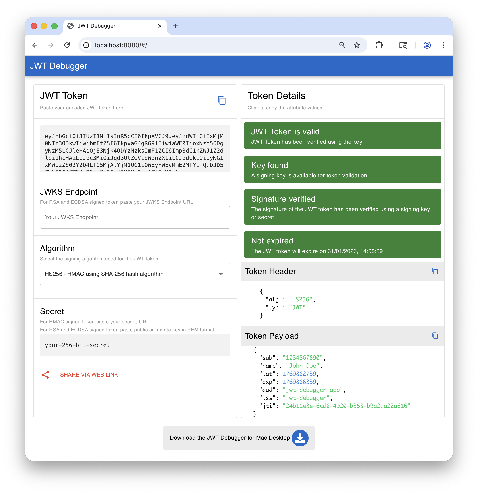
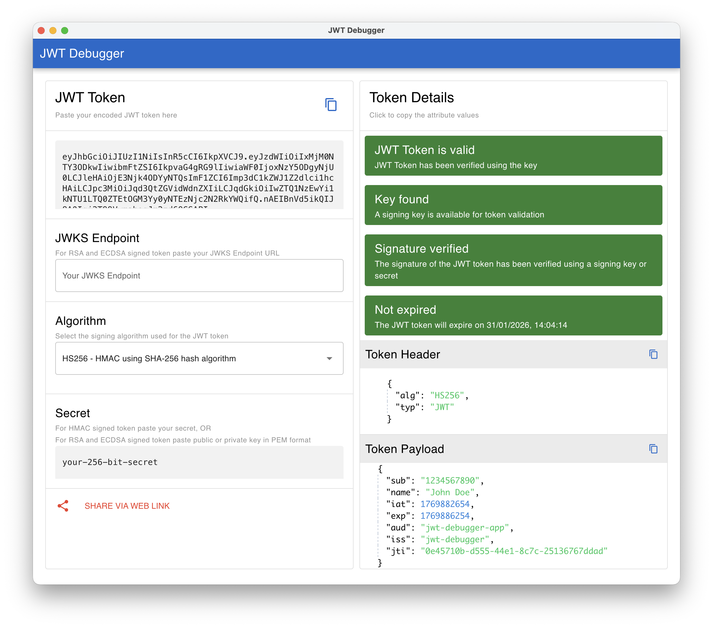

# JWT Debugger
An application for debugging, validating, and analyzing JSON Web Tokens (JWTs) supporting all major JWT algorithms including HMAC, RSA, ECDSA, and PSS. Support for JWKS endpoint.

> **Note:** This is a functional fork of [axioms-io/axioms-jwt-debugger](https://github.com/axioms-io/axioms-jwt-debugger), updated to latest version of Quasar and other dependencies.

- Web version with offline support using progress web app 

- Desktop versions for Windows, Mac, and Linux (Debian)

# Token Validation

- Using JSON Web Key Set (JWKS) Endpoint for token signed using `RSA` and `ECDSA` algorithms.
- Using Secret Key for token signed using `HMAC` algorithms.

# Bug and feature request
Please use Github issues to create any bugs or feature request.

